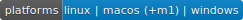

neo-mamba
-----------

.. image:: https://img.shields.io/github/actions/workflow/status/CityOfZion/neo-mamba/validate-pr-commit.yml?branch=master
  :target: https://shields.io/

.. image:: https://coveralls.io/repos/github/CityOfZion/neo-mamba/badge.svg?branch=master
  :target: https://coveralls.io/github/CityOfZion/neo-mamba?branch=master

.. image:: http://www.mypy-lang.org/static/mypy_badge.svg
  :target: http://mypy-lang.org/

.. image:: https://img.shields.io/badge/code%20style-black-000000.svg
   :target: https://github.com/psf/black

.. image:: https://img.shields.io/pypi/pyversions/neo-mamba
   :target: https://pypi.org/project/neo-mamba

This project is for you if you're looking to use Python to

* Deploy smart contracts
* Transfer NEP-11 and NEP-17 tokens
* Vote for your favourite consensus node
* Interact with on-chain smart contracts
* Manage wallets
* Build and sign specialized transactions
* and more..

This SDK provides building blocks for Python developers to interact with the NEO blockchain without requiring to run a full node.
In order to interact with the chain and obtain information it relies heavily on RPC nodes. You can find a list of public RPC nodes `here <https://dora.coz.io/monitor>`_.

Please report any issues on `Github <https://github.com/CityOfZion/neo-mamba/issues>`_ or submit ideas how to improve the SDK.

Also check out our Python smart contract compiler `Boa <https://github.com/CityOfZion/neo3-boa>`_ !

Installation and usage
----------------------
Installation instructions, how to interact with smart contracts as well as API reference documentation can be found at
https://mamba.coz.io/

Developing or contributing
--------------------------
Install the requirements, modify the code and PR :-)
::

   pip install -e .[dev]

For larger changes consider opening an issue first to discuss the change. Below are a few guidelines for contributing

* The project uses `Black <https://github.com/psf/black>`_ for code formatting. PRs will fail if formatted incorrectly.
  You might want to `integrate <https://black.readthedocs.io/en/stable/integrations/editors.html>`_ `black` into your
  editor or run it manually with `make black`.
* All public functions/classes must have docstrings.
* All your code must be typed. Test your typing with `make type`. In rare cases it might be hard/impractical to add typing.
  Point it out if that is the case and add a short description why we could do without.
* Add tests that cover the newly added (or changed if applicable) code. Use `make test` and `make coverage`.
