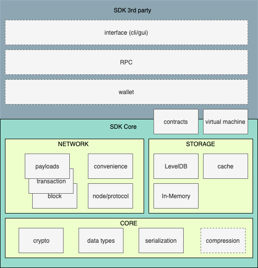

.. _library-intro:

************
Introduction
************

The neo-mamba library contains a collection of modules to help work with the `NEO3 <https://neo.org/>`_ blockchain.

It can be considered the successor of `neo-python <https://github.com/CityOfZion/neo-python>`_. The former targets the NEO 2.x blockchain, whereas this library targets NEO 3.x. It is rewritten from scratch with the vision of being an SDK first with node support second. Its goal is to lower the entry barrier for working with the NEO3 blockchain by providing the primary building blocks with full and concise documentation. Convenience modules and functionality to support full node capabilities will selectively be present. An example of such convenience functionality is the SyncManager, with its accompanying NodeManager, which take away the burden of syncing the blockchain and staying in sync, allowing the user to focus on post processing of the incoming data instead of retrieving it.

Overview
========
A high level overview of the library can be seen in the diagram below. Solid lines indicate currently present, dashed lines indicate envisioned. Not all of the envisioned components will directly end up in this library. The library is intended to be build on top of, not to be all encompasing. The community is encouraged to build and maintain some of the envisioned components. Interfaces, such as for the virtual machine, can be expected to become part of the core library to ensure interoperablity, whereas specific implementations based on these interfaces may live in a separate repository/package. 

Big effort is made to document and correctly type all modules. However, not everything can be typed as strictly as hoped for or is sane todo. One such case is the format of :ref:`bytes <python:typebytes>` and :ref:`bytearray <python:typebytearray>` types. Whenever a function accepts such objects it **always** expects its sequence to be hex-escaped unless explicitely mentioned otherwise. 

Yes::

   b'\x01\x02\x03'

No::

   b'010203'

Final words
===========
Enjoy and please report issues on Github!