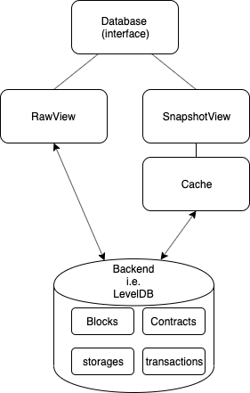

.. _library-storage-index:

*******
Storage
*******

This chapter gives a high level overview of the storage layer and its usage.

The storage layer provides a generic interface for persisting and retrieving common blockchain data. It is a tradeoff between having a developer friendly interface and providing the means necessary for the interoperability layer and smart contract execution. 

Two backend implementations, In-Memory and LevelDB, are part of this SDK with the posibility to implement custom ones by implementing a set of interfaces. For more information on implementing alternative backends see this :ref:`HOWTO <backends-howto>`.

Overview
========
There are four main storage topics that this layer takes care of

1. Blocks
2. Transactions
3. (Smart) contracts
4. Smart contract storage

The ``contracts`` topic stores the generic data related to the actual smart contract; its code and a manifest with contract permissions and the `ABI <https://github.com/neo-project/proposals/blob/master/nep-3.mediawiki>`__. The ``smart contract storage`` covers individual smart contract storages. i.e. balances for a NEP-17 contract.

Before we learn how to access the information of the individual topics, let us first get an idea of the different ways data can be accessed in general.

A database object has two views. 

1. A ``RawView`` for direct access to the backend. Any changes through the put/update/delete operations are instantly persisted. 
2. A second view called ``SnapshotView`` creates a snapshot of the current database state and provides cached access. This copy can be freely operated on withoutout having to fear accidental modification of the underlying data. A `commit()` action is required to persist the changes to the real backend.

One might wonder why caching is present when many backends have their own (and likely better) caching mechanism. The caching layer is there not just to provide "improved" access speeds, but more importantly to provide a generic way to clone state, operate on the state, and discard and rollback the state under certain conditions. 

The main use-case for these requirements are block processing. All transactions in a block are executed by the NEO virtual machine. Such transactions can include transformations to smart contract storages (like a NEP-17 balance). If after a certain amount of storage transformations an error occurs (e.g. because the user reached his balance limit) then all transformations need to be discarded/rolled back to the starting state. Instead of forcing each backend implementation to create their own mechanism, a generic one is in place to handle this for you.

Accessing data
==============

As described in the overview we have four main topics of data (blocks, contracts, storages and transactions) in our data store. Each topic can be accessed via a property on the database object. The following example accesses the smart contract storage topic

.. code:: python

    from neo3.core import types
    from neo3.storage import implementations
    from neo3.storage import StorageKey, StorageItem

    def main():
        # Prepare some data

        # Dummy contract id for demonstration purposes
        contractid = 1

        key1 = StorageKey(contractid, key=b'key1')
        key2 = StorageKey(contractid, key=b'key2')
        value1 = StorageItem(b'value1')
        value2 = StorageItem(b'value2')

        # Create a database instance
        db = implementations.MemoryDB()

        # Create a direct access view
        raw_view = db.get_rawview()

        # Persist data to the (smart contract) storages topic in the backend.
        raw_view.storages.put(key1, value1)
        raw_view.storages.put(key2, value2)

        # Query the data
        for k, v in raw_view.storages.all(contract_id=contractid):
            print(k, v)

    if __name__ == "__main__":
        main()

Each topic has the common ``add``, ``put``, ``delete``, ``update`` and ``all`` methods. Certain topics have additional specialized methods like ``get_by_height()`` for the ``blocks`` topic (as opposed to the default by-hash) to improve the developer experience. Check out the interfaces for each topic below.

Let us extend the previous example with the code below to demonstrate the snapshot mechanism.

.. code:: python

    key3 = StorageKey(contractid, key=b'key3')
    value3 = StorageItem(b'value3')
    snapshot_view = db.get_snapshotview()
    
    snapshot_view.storages.put(key3, value3)

    # Query the data
    print("Snapshot data")
    for k, v in raw_view.storages.all(contract_id=contractid):
        print(k, v)

    print("Backend data - without snapshot data")
    for k, v in raw_view.storages.all(contract_id=contract_id):
        print(k, v)
        
    # Now persist to the backend
    snapshot_view.commit()

    print("Backend data - updated")
    for k, v in raw_view.storages.all(contract_id=contract_id):
        print(k, v)