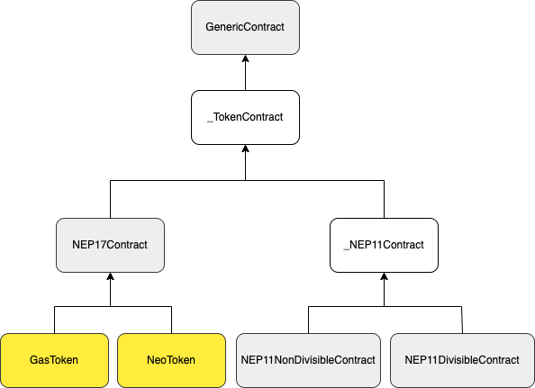

# Smart contracts

This document explains how to work with smart contracts. First we'll establish the mental model of working with 
blockchains. If you are already familiar with the NEO blockchain or talking to smart contracts on blockchains in general 
you can go directly to the [interaction section](#interacting-with-smart-contracts). Next we'll look have a what comes 
in to play in a basic smart contract interaction. Followed by that we build an understanding of how the wrappers work 
before diving into the breakdown of a NEP-17 token transfer where all learned comes together.

After reading this chapter you'll have an understanding of the major components involved in interacting with smart 
contracts. You be able to do all common interactions with a smart contract of choice and have the foundational knowledge 
that allows you to follow the [examples](https://github.com/CityOfZion/neo-mamba/tree/master/examples) on the Github repo.

## What are smart contracts?

Smart contracts are nothing more than programs of which the compiled code is stored on the blockchain. They 
expose a public API which you can call to execute its functions, whether that be transfering
tokens, executing some algorithm or just reading stored data is up to the contract author. It is important to realise
that the smart contract code does not live on your machine and is executed on a remote network (the blockchain). 

Add to this that smart contracts are "compiled" to a custom language and executed by a custom processor 
(the NEO Virtual Machine). That means that your Python code cannot talk Python to the smart contract, but that a 
translation has to happen. This library performs that translation under the hood and helps communicate between your 
machine and the smart contract.

## Interacting with smart contracts
There are 2 layers in this library used to talk to smart contracts. First, wrappers for various 
[smart contract types](#types-of-smart-contracts) to make calling functions on them feel almost the same as calling
regular Python code. Second, a `ChainFacade` class which acts as the network gateway. It will build and sign a 
transaction if state needs to be persisted or use other means for read-only (free) executions.

Lets breakdown the following example which queries the blockchain for the symbol of the Neo token contract and 
will return `NEO` as result.
<a name="symbol-reading-example"></a>
```py3
facade = ChainFacade.node_provider_mainnet()
neo = NeoToken()
await facade.test_invoke(neo.symbol())
```
Line `1` creates a facade for communicating with the MainNet. While it can be configured to perform automatic 
transaction signing when persisting state, for now it is only important to know that this configured the facade to talk 
to a MainNet RPC node internally.

Line `2` instantiates our first wrapper. The `NeoToken` class wraps around the native [NeoToken](https://github.com/neo-project/neo/blob/77ee2cc5b6ea371efdf3be506b173c6304b0fc01/src/Neo/SmartContract/Native/NeoToken.cs#L31) 
smart contract (built-in to the chain) and gives a convenient way of calling the public functions of the smart contract.

Line `3` is where the interesting parts happen. The call to `neo.symbol()` does not actually return "NEO", instead it 
builds a sequence of NEO Virtual Machine instructions that the network understands. These instructions need to be sent
to the network, which is where the `facade` comes in to play. The `facade` has two ways of sending the instructions

1. `test_invoke()` - Use for read-only calls. Does not cost GAS.
2. `invoke()` - Use for state changing calls. Costs GAS.

!!! tip

    There are multiple variations of the `*invoke*()` call such as `invoke_fast` and `invoke_multi`. See the API docs 
    for more information.


In the example above `test_invoke()` is used because the `symbol()` function does not modify state. It just reads data 
stored and so there is no reason to pay for it and grow the chain unnecessary. In later sections and chapters state 
modifying transactions will be discussed. We'll also learn how to sign and pay the transactions with an account of our 
choice. For now let's first get a greater understanding of the various wrappers that exist.


## Contract wrappers
The smart contract wrappers are a key component in simplifying smart contract interaction. Like the facade they live in 
the `neo3.api.wrappers` module. The NEO blockchain has a few native contracts build into the chain such as the NEO and 
GAS tokens, but also contracts providing information regarding the chain configuration like the 
[PolicyContract](https://github.com/neo-project/neo/blob/77ee2cc5b6ea371efdf3be506b173c6304b0fc01/src/Neo/SmartContract/Native/PolicyContract.cs#L22).
For these kind of contracts specialised wrappers exist like `NeoToken`, `GasToken`, `PolicyContract` and `RoleContract`.

### Types of smart contracts
Technically speaking there are no types of smart contracts. However, they can implement standards that give 
them compartalisable behaviour. For example implementing [NEP-11](https://github.com/neo-project/proposals/blob/master/nep-11.mediawiki) 
gives NFT like behaviour, [NEP-17](https://github.com/neo-project/proposals/blob/master/nep-17.mediawiki) gives 
fungible token behaviour. NEO and GAS are examples of NEP-17 tokens, but there are many more NEP-17 tokens in the system.
To easily use these contracts there are more generic wrappers available such as `NEP17Contract`, `NEP11DivisibleContract` and 
`NEP11NonDivisibleContract`.

All they require is the contract hash and you're ready to call them like NEO or GAS. For example wrapping the 
[TOTHEMOON](https://dora.coz.io/contract/neo3/mainnet/0x56199aa066633745de4d603e6477881455c08243) token is done as follows 

```py3 linenums="0"
from neo3.core import types
from neo3.api.wrappers import NEP17Contract

contract_hash = types.UInt160.from_string("0x56199aa066633745de4d603e6477881455c08243")
ttm = NEP17Contract(contract_hash)
```
You can now `transfer()` TTM tokens, query the `balance_of()` an account or call any of the other NEP-17 methods. If the
contract exposes additional functions beyond those from the standard then there is the generic 
`call_function(<name>,<args>)` that can always be used.

Lastly, if none of the existing wrappers suit the contract use `GenericContract` or better create your own wrapper on 
top of `GenericContract`. 

### Hierarchy

In the previous section we described the various wrapper classes that can be used from most specialised to most generic. 
The diagram below shows the structure



* Yellow are the most specialised wrappers.
* White are building blocks and not intended to be used on their own. They are shown to make the picture complete.

## Modifying chain state
This section shows what it takes to modify chain state, specifically we'll show how to transfer a NEP-17 token (NEO) and 
break down the steps and options.

We've [previously](#symbol-reading-example) seen how to query the `symbol` of a contract by using the `test_invoke()` 
method on the facade. Such queries do not modify state and thus does not require validation by the consensus nodes. 
Transfering a token, which changes the balance of 2 accounts, on the other hand does require verification to prevent 
unauthorized transfers. This verification and `transfer` script execution costs compute and thus has a GAS price 
associated to it.

State modifications always need to be communicated to the network using a [Transaction](https://github.com/CityOfZion/neo-mamba/blob/master/neo3/network/payloads/transaction.py#L199).
This container will hold the `script` that executes the `transfer` action, signatures for 
approval of the modification and has GAS attached to pay for the verification and execution fees. 

### NEP-17 transfer example
Let's see how this looks in code and then break it down line-by-line.
```py3
import asyncio
from neo3.api.wrappers import ChainFacade, NeoToken
from neo3.api.helpers.signing import sign_insecure_with_account
from neo3.network.payloads.verification import Signer
from neo3.wallet.wallet import Wallet


async def main():
    neo = NeoToken()
    
    wallet = Wallet.from_file("./mywallet.json")
    account = wallet.account_default
    
    facade = ChainFacade.node_provider_mainnet()
    facade.add_signer(
        sign_insecure_with_account(account, password="123"),
        Signer(account.script_hash)
    )
    
    destination = "NUVaphUShQPD82yoXcbvFkedjHX6rUF7QQ"
    print(await facade.invoke(neo.transfer(account.address, destination, 10)))

if __name__ == "__main__":
    asyncio.run(main())
```
#### Wallet account setup
Skipping the imports, startup boilerplate code and NeoToken wrapper creation (that we've seen before) we start here
```py3 linenums="11"
wallet = Wallet.from_file("./path_to/mywallet.json")
account = wallet.account_default
```
In order to transfer tokens we need to have an account with funds to transfer them from. Secondly, all transactions are
paid for with `GAS`. So while this example transfers `NEO`, the account must also hold a bit of `GAS` to pay for the 
fees. For the aforementioned reasons we assume you already have a [NEP-6](https://github.com/neo-project/proposals/blob/master/nep-6.mediawiki)
wallet that we'll load from disk.

!!! tip
    If you want to learn upfront how much gas a transaction will cost then use the `estimate_gas()` helper on the facade.

#### Facade setup
Next up is setting up and configuring the facade to automatically sign our transaction(s).
```py3 linenums="14"
facade = ChainFacade.node_provider_mainnet()
facade.add_signer(
    sign_insecure_with_account(account, password="123"),
    Signer(account.script_hash)
)
```
The first line we've seen before and creates a facade configured to communicate with a MainNet RPC node. It is possible 
to provide your own RPC node if you'd like by manually creating the `ChainFacade`. The facade can be configured to 
automatically use a specific wallet account for signing transactions when `invoke()` is called on the facade. This is 
done through the `add_signer()` function which takes two arguments

1. a callback function to perform the actual transaction signing
2. a [Signer](https://github.com/CityOfZion/neo-mamba/blob/5bc73174f91f6c2466743fbeb53f55dfb35786da/neo3/network/payloads/verification.py#L68) 
object indicating where the signature is valid

The callback function takes the provided account information, creates a signature and embeds it in the `Transaction`.  
It states that `account` agrees with the modification that the transaction `script` will perform. The consensus nodes
will verify the validity of the signature before performing the transfer. 

The `Signer` will have a scope of `CALLED_BY_ENTRY` by default. This means that the signature is only valid inside the
first contract called. In this case that will be the `NeoToken` contract. This scope can be checked by the 
`CheckWitness` function inside smart contracts to avoid abuse. There are many scenarios where one contract may need to
call one or more other contracts. For such cases the signer can be configured with other scope options and rules. This
however is beyond the scope of this example and can be learned more about [in this excellent article](https://neospcc.medium.com/thou-shalt-check-their-witnesses-485d2bf8375d) 
by the NSPCC.

!!! note
    1. Calling `test_invoke()` instead of `invoke()` will automatically add the `Signer`, without calling the callback, 
    to limit the scope. This is useful if you want to realistically simulate your state changing calls.
    2. You can add multiple signers. The first signer added is considerd the `sender` and will pay for the fees.

#### Invoke & receipt
Now that we're done with the preparation we can perform the actual transfer.
```py3 linenums="21"
print(await facade.invoke(neo.transfer(account.address, destination, 10)))
```
The `neo.transfer()` call will generate VM instructions to perform the requested token transfer. The instructions are
passed to `facade.invoke()` which builds the transaction, signs it and sends it to the network. It will wait and poll 
the network for a receipt and print that. Among the `result` of calling the `transfer` function the receipt contains 
notifications emitted by the smart contract(s) and more. 

An example receipt for the transfer may look as follows

```py3 linenums="0"
InvokeReceipt(
    tx_hash=619759221b434356e76783534b7ca9dc8c8ec36f25c1943c2262f727736c862a, 
    included_in_block=18419, 
    confirmations=3, 
    gas_consumed=9977750, 
    state=HALT, 
    exception=None, 
    notifications=[
        Notification(
            contract=d2a4cff31913016155e38e474a2c06d08be276cf, 
            event_name=Transfer, 
            state=StackItem(type=ARRAY, value=[
                StackItem(type=BYTE_STRING, value=b'3\xfc\xa3\x0b\xc0,\x81%\xc2\xb7\xb0\x85\xb7\x96\x13Pk\xbf=O'), 
                StackItem(type=BYTE_STRING, value=b'^\x1c{1\xf3\xd1\x9b\xc3\xb9\xaeaY\xee\x80v\xc7\xcb1\x11z'), 
                StackItem(type=INTEGER, value=10)
                ]
            )
        )
    ], 
    result=True
)
```

!!! tip 
    If you would like to return immediatly and not wait for a receipt use `invoke_fast()` instead of `invoke()`. 
    This will return a transaction id.