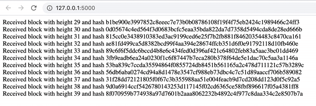

.. _tutorial-index:

############
  Tutorial
############

After a quick introduction and environment setup we'll create a small program that syncs the blockchain and shows some block information on a webpage as the blocks flow in.

Introduction
------------
This SDK intends to provide building blocks for Python developers to interact with the NEO blockchain as a means to lower the entry barrier. It is a work in progress and thus you can expect that not all parts of the blockchain are supported. What is present should be functioning correctly unless explicitly mentioned (e.g. because they depend on structures not yet available). Please report any issues on `Github <https://github.com/CityOfZion/neo-mamba/issues>`_ or submit ideas how to improve the SDK.

Have a look at the :ref:`What's new <whatsnew-index>` pages to get a feel what you can expect.

Setup
-----

There is one system dependency, namely `Python 3.8 <https://www.python.org/downloads/release/python-3810/>`_. The other dependencies are covered by ``pip``.

It is recommended to put all project dependencies into its own virtual environment, this way we don't pollute the global installation which could lead to version conflicts.

1. Install from Github:

  ::

    git clone https://github.com/CityOfZion/neo-mamba.git
    cd neo-mamba

    # create virtual environment using Python 3.8 and activate
    python3.8 -m venv venv
    source venv/bin/activate

    # install the package in an editable form
    (venv) pip install wheel -e .

2. Install from PyPi

  ::

    # create project dir
    mkdir myproject
    cd myproject

    # create virtual environment using Python 3.8 and activate
    python3.8 -m venv venv
    source venv/bin/activate

    (venv) pip install wheel neo-mamba

If you intend the use LevelDB as backend (as opposed to the In-Memory solution), then you'll also have to install that system dependency. 

On OSX ``brew install leveldb``, on Ubuntu/Debian ``apt-get install libleveldb-dev``. Finally, install the LevelDB Python wrapper ``pip install plyvel``.

Example program
---------------

We will use `quart <https://github.com/pgjones/quart>`_ as micro web framework which is a Flask superset and very straight forward to understand. Start by installing it

::

  pip install quart

Next, the full program is listed first and we'll break down the individual parts. On a high level a web server is started serving our page and a websocket. Secondly, we start the block syncing process, listen to incoming block events and send the results via the websocket to the page.

Let's get to it!

.. code-block:: python
   :linenos:

    import asyncio

    # web specific imports
    from quart import Quart, websocket

    # neo3 specific imports
    from neo3 import settings
    from neo3.network import convenience, payloads
    from neo3.core import msgrouter

    msg_queue = asyncio.Queue()
    
    # web specific part
    app = Quart(__name__)
    
    with open('./index.html', 'r') as f:
        html_page = f.read()

    @app.route('/')
    async def index():
        return html_page

    @app.websocket('/ws')
    async def ws():
        while True:
            msg = await msg_queue.get()
            await websocket.send(msg)

    # neo specific part
    def connection_done(node_client, failure):
        if failure:
            asyncio.create_task(
                msg_queue.put(f"Failed to connect to {failure[0]} reason: {failure[1]}."))
        else:
            asyncio.create_task(
                msg_queue.put(f"Connected to node {node_client.version.user_agent} @ {node_client.address}"))

    def block_received(from_nodeid: int, block: payloads.Block):
        asyncio.create_task(msg_queue.put(f"Received block with height {block.index} and hash {block.hash()}"))

    async def run_neo():
        # set network magic to NEO TestNet
        settings.network.magic = 877933390

        # add a node to test against
        settings.network.seedlist = ['seed1.neo.org:20333']

        # listen to the connection events broad casted by the node manager
        msgrouter.on_client_connect_done += connection_done

        # listen to block received events
        msgrouter.on_block += block_received

        node_mgr = convenience.NodeManager()
        node_mgr.start()

        sync_mgr = convenience.SyncManager()
        await sync_mgr.start()

    if __name__ == "__main__":
        loop = asyncio.get_event_loop()
        loop.create_task(run_neo())
        app.run(loop=loop)

Copy the following in a file name ``index.html`` and place it in the same folder as the example Python program.

.. code-block:: html
   :linenos:

   <!DOCTYPE html>
   <html lang="en">
   <head>
       <meta charset="UTF-8">
       <title>Title</title>
       
   </head>
   <body>
       

   </body>
   </html>

Let's start with the webservice

.. code-block:: python
   :linenos:
   :lineno-start: 11

        msg_queue = asyncio.Queue()
        
        # web specific part
        app = Quart(__name__)
        
        with open('./index.html', 'r') as f:
            html_page = f.read()

        @app.route('/')
        async def index():
            return html_page

        @app.websocket('/ws')
        async def ws():
            while True:
                msg = await msg_queue.get()
                await websocket.send(msg)

Lines ``19-21`` create an endpoint to which we can browse with a webbrowser at the server address we will learn about later. This is the landing page for the web browser and it returns a standard HTML page for which we read the source at lines ``16-17`` to keep the code small. The source code for this HTML page can be found :download:`here </_examples/index.html>`. Place it in the same folder as the sample code.

The HTML page connects to the websocket server started at lines ``23-27``. This endpoint reads messages from the ``msg_queue`` (Line ``11``) and forwards them to the HTML page to be displayed. We'll see how this message queue is filled once we discuss the blockchain syncing code.

At line ``63`` we call :code:`app.run(loop=loop)` which starts the webservice and greets you with the address we can point the webbrowser to.

.. code-block:: python

   Running on http://127.0.0.1:5000 (CTRL + C to quit)

Next, we'll discuss the the blockchain syncing part that comes from the SDK. You can read more about the inner details of that process in the :ref:`convenience syncing <library-network-convenience>` chapter. The code discussed here is actually a slightly modified version of the :ref:`example code <library-convenience-full-usage-example>` used in that chapter. 

The :code:`run_neo()` function should be self-explanatory. 

.. code-block:: python
   :lineno-start: 41

   async def run_neo():
      # set network magic to NEO TestNet
      settings.network.magic = 844378958

      # add a node to test against
      settings.network.seedlist = ['seed1.neo.org:20333']

We start by configuring the network magic. This is a special number identifying the Main network, test network or even a privat network. It is shared and validated during the first connection to the network and will disconnect nodes if there is a mismatch. The seedlist is consulted by the node manager as the first entry point to connect to the network by the code.

.. code-block:: python
   :lineno-start: 54

    node_mgr = convenience.NodeManager()
    node_mgr.start()

Next, we start the sync manager which takes care of retrieving the blocks from the network. It broadcasts events that we listen to.

.. code-block:: python
   :lineno-start: 57

   sync_mgr = convenience.SyncManager()
   await sync_mgr.start()

.. code-block:: python
   :lineno-start: 51

   # listen to block received events
   msgrouter.on_block += block_received

Every time a block is received on the network we call our event handler at ``block_received()``. This handler puts a
message into the ``msg_queue`` that our websocket server reads from once a web client has connected to the websocket.

.. code-block:: python
   :lineno-start: 38

   def block_received(from_nodeid: int, block: payloads.Block):
      asyncio.create_task(msg_queue.put(f"Received block with height {block.index} and hash {block.hash()}"))

The sample HTML file does connects to this sockets and displays the blocks as flowing in as they are retrieved from the
network as shown below. With that the circle is complete.

